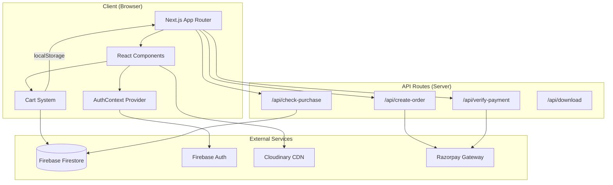

# 📋 XMP Store — Project Analysis

> **A premium Lightroom preset e-commerce platform built with Next.js, Firebase, and Razorpay.**

---

## 🔧 Tech Stack

| Layer | Technology | Version |
|-------|-----------|---------|
| **Framework** | Next.js (App Router) | 16.1.6 |
| **Language** | TypeScript + JavaScript | TS 5.x |
| **UI Library** | React | 19.2.3 |
| **Styling** | Tailwind CSS | 4.2.1 |
| **Animations** | Framer Motion | 12.38.0 |
| **Auth & Database** | Firebase (Auth + Firestore) | 12.10.0 |
| **Image Hosting** | Cloudinary | 2.9.0 |
| **Payments** | Razorpay | 2.9.6 |
| **Icons** | Lucide React | 0.577.0 |
| **Image Compare** | react-compare-image | 3.5.14 |
| **Fonts** | Geist (via `next/font`) | — |

---

## 📁 Project Structure

```
preset-store/
├── app/                        # Next.js App Router pages
│   ├── layout.tsx              # Root layout (AuthProvider, Razorpay script)
│   ├── page.tsx                # Home page (hero, search, category filter, preset grid)
│   ├── globals.css             # Global styles + Tailwind theme tokens
│   ├── admin/page.tsx          # Admin dashboard (stats, charts, upload, preset table)
│   ├── cart/                   # Cart page
│   ├── contact/                # Contact page
│   ├── free/                   # Free presets page
│   ├── login/page.tsx          # Login (email/password + Google OAuth)
│   ├── signup/page.tsx         # Signup (email/password)
│   ├── my-presets/             # User's purchased/downloaded presets
│   ├── preset/[id]/page.tsx    # Individual preset detail page
│   ├── presets/                # Presets listing page
│   ├── upload/                 # Upload page
│   ├── view-live-preset/       # Live preset viewer
│   └── api/                    # Server-side API routes
│       ├── create-order/       # Creates Razorpay order
│       ├── verify-payment/     # Verifies Razorpay signature + saves purchase
│       ├── check-purchase/     # Checks if user owns a preset
│       └── download/           # Download endpoint (incomplete)
│
├── components/                 # Reusable UI components
│   ├── Navbar.tsx              # Main navigation with cart, auth, admin access
│   ├── CartDrawer.tsx          # Slide-out cart drawer with checkout
│   ├── PresetCard.tsx          # Preset card with parallax tilt effect
│   ├── BeforeAfterSlider.tsx   # Before/after image comparison slider
│   ├── Hero.tsx                # Hero section with typewriter animation
│   ├── AdminLayout.tsx         # Admin sidebar layout with glassmorphism
│   ├── BubblesBackground.tsx   # Animated background bubbles
│   ├── ProtectedRoute.tsx      # Auth guard component
│   ├── CategoryFilter.tsx      # Category filter buttons
│   ├── SearchBar.tsx           # Search input component
│   ├── DynamicTitle.tsx        # Dynamic page title component
│   ├── ImageZoom.tsx           # Image zoom component
│   └── home/                   # Home page sub-components
│       ├── HeroSection.tsx     # Alternative hero section
│       ├── CTASection.tsx      # Call-to-action section
│       ├── Freepreset.tsx      # Free preset showcase
│       └── TrendingPresets.tsx  # Trending presets section
│
├── context/
│   └── AuthContext.tsx         # Auth provider (login state, guest→user cart merge)
│
├── lib/                        # Utility libraries
│   ├── firebase.ts             # Firebase init (auth + Firestore)
│   ├── firebase.js             # Firebase init (auth + Firestore + Storage + Google)
│   ├── auth.ts                 # Auth functions (signup, login, Google, password reset)
│   ├── cart.ts                 # Cart logic (localStorage + Firebase sync)
│   ├── cloudinary.js           # Cloudinary config
│   ├── saveUserPreset.ts       # Save purchased/downloaded preset to Firestore
│   ├── firebaseCart.ts         # Firebase cart CRUD operations
│   ├── useAuth.ts              # useAuth hook (standalone)
│   ├── useCart.ts              # useCart hook
│   └── useProtectedAction.ts   # Hook to guard actions behind auth
│
├── public/                     # Static assets
│   ├── logo.png                # Store logo
│   └── presets/                # Preset image assets
│
├── preset-ui/                  # Secondary/experimental UI project
│
├── next.config.js              # Image domains (Cloudinary, Google)
├── tsconfig.json               # TypeScript configuration
├── postcss.config.mjs          # PostCSS + Tailwind plugin
└── package.json                # Dependencies & scripts
```

---

## 🏗️ Architecture Overview



---

## 🔑 Key Features

### 1. Authentication
- **Email/password** signup and login
- **Google OAuth** sign-in via popup
- **Password reset** via Firebase email
- **Auto user creation** in Firestore on first login
- **Protected routes** redirect unauthenticated users to `/login?redirect=...`

### 2. Preset Browsing
- **Search** presets by name (real-time filtering)
- **Category filter**: All, Portrait, Travel, Cinematic, Street
- **Preset cards** with parallax mouse-tracking tilt effect
- **Before/after slider** for image comparison
- **Animated hero** with typewriter text effect

### 3. Preset Detail Page
- Staggered entrance animations (title, price, description)
- Image parallax slide animation
- Purchase gating: free download vs. paid checkout
- **Fly-to-cart** animation (clone image flies to cart icon)
- Toast notifications (success/error)
- Post-purchase download button

### 4. Shopping Cart
- **Dual storage**: localStorage (instant) + Firebase Firestore (persistent)
- **Guest cart merge**: on login, guest cart items merge into user's Firebase cart
- **Custom events**: `cart:update` event for cross-component reactivity
- **Slide-out drawer** with item list, total, and checkout button
- **Cart badge** with bounce animation on count change

### 5. Payment Integration (Razorpay)
- Server-side order creation (`/api/create-order`)
- Client-side Razorpay checkout popup
- Server-side HMAC-SHA256 signature verification (`/api/verify-payment`)
- Purchase record saved to Firestore on success
- Purchase check API (`/api/check-purchase`)

### 6. Admin Dashboard
- **Role-based access**: checks `isAdmin` flag in Firestore `users` collection
- **Glassmorphism UI** with animated bubble background
- **Sidebar navigation**: Dashboard, Presets, Orders, Users
- **Stats cards** with hover glow animations (Framer Motion)
- Upload preset form (UI only — not wired to backend)
- Revenue chart (static/placeholder data)

### 7. User Library (`/my-presets`)
- View purchased and downloaded presets
- Records stored in `user_presets` Firestore collection

---

## 🗄️ Firestore Collections

| Collection | Document ID | Fields |
|-----------|------------|--------|
| `presets` | auto-generated | `name`, `price`, `category`, `description`, `afterImage`, `beforeImage`, `downloadUrl` |
| `users` | `{uid}` | `uid`, `email`, `isAdmin`, `createdAt` |
| `users/{uid}/cart` | `{presetId}` | full preset object |
| `purchases` | `{userId}_{presetId}` | `userId`, `presetId`, `paymentId`, `createdAt` |
| `user_presets` | auto-generated | `userId`, `presetId`, `type`, `createdAt` |

---

## 🎨 Design System

- **Color Palette**: Black (`#0e0c0a`) background, purple (`#7c3aed` / `#a855f7`) accents, zinc grays
- **Effects**: Glassmorphism (backdrop-blur + semi-transparent), neon glow shadows, gradient buttons
- **Animations**: Framer Motion spring transitions, CSS `transition-all`, parallax tilt, typewriter
- **Typography**: Geist Sans + Geist Mono (Google Fonts via `next/font`)
- **Layout**: Responsive grid (1–4 columns), centered max-width containers

---

## 🚀 Scripts

```bash
npm run dev      # Start development server (Next.js)
npm run build    # Production build
npm run start    # Start production server
npm run lint     # Run ESLint
```

---

## ⚠️ Notable Observations

1. **Duplicate Firebase configs**: Both `firebase.ts` and `firebase.js` exist with slightly different exports
2. **Hardcoded credentials**: Firebase API keys and Cloudinary secrets are committed in source code
3. **Incomplete download API**: `/api/download/route.js` references undefined variables (`purchased`, `downloadURL`)
4. **Static admin stats**: Dashboard values are hardcoded, not fetched from Firestore
5. **Duplicate cart logic**: `firebaseCart.ts` and `cart.ts` both implement Firebase cart operations independently
6. **Mixed file types**: Some files are `.js`, others `.ts`/`.tsx` — inconsistent TypeScript adoption
7. **Heavy use of `any`**: TypeScript types are mostly `any`, reducing type safety
